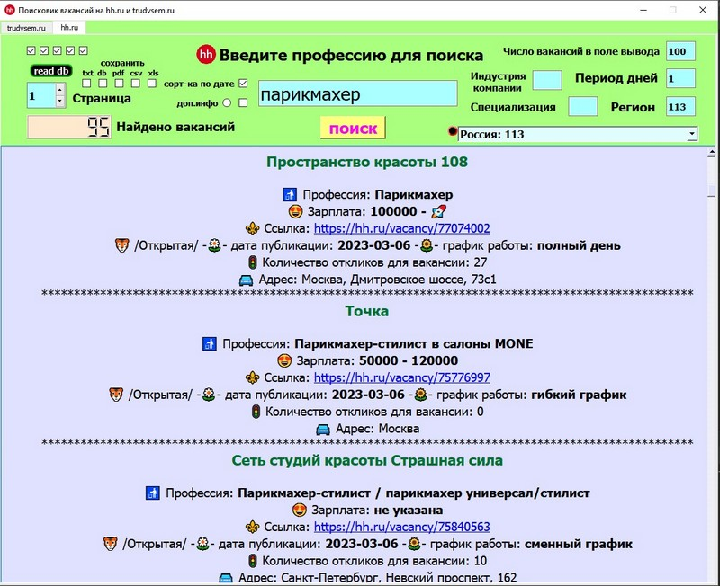

# Парсер вакансий с hh.ru  и trudvsem.ru

## Windows:
### pyinstaller
     pyinstaller main.py -F -w --i=img/favicon.ico
### nuitka
     python -m nuitka --windows-disable-console --onefile --follow-imports --enable-plugin=pyqt5 --windows-icon-from-ico=img/favicon.ico main.py
### release

